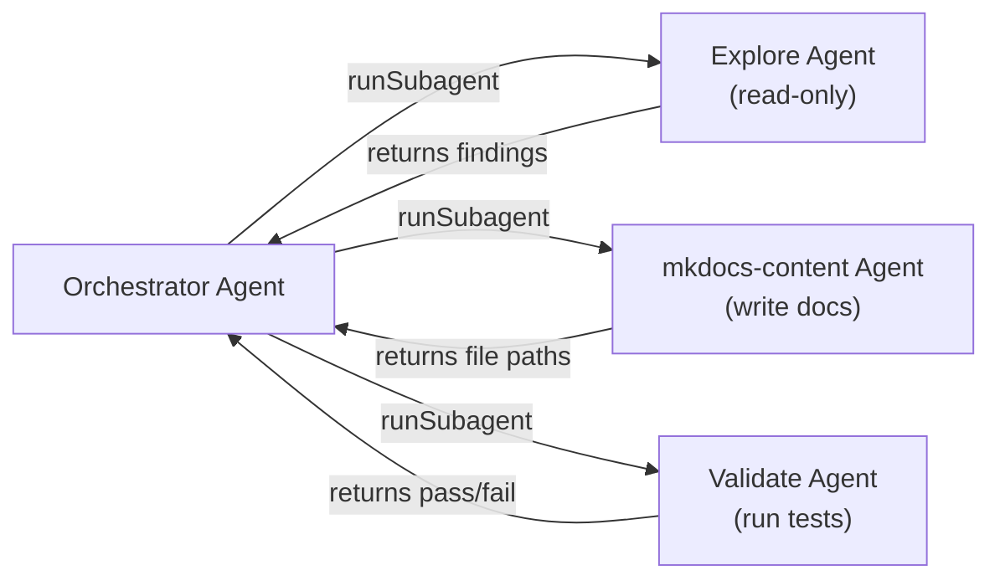

# Advanced Patterns & Workflows

> **Level:** Advanced
> **Pre-reading:** [Fundamentals · Core Concepts](../fundamentals/01-core-concepts.md) · [Intermediate · Working Together](../intermediate/01-working-together.md)

---

## Hooks — Deterministic Lifecycle Control

Instructions and agents are probabilistic — they guide Copilot but cannot guarantee specific outcomes. **Hooks** are the escape hatch for when you need deterministic, guaranteed behaviour at specific lifecycle points.

A hook is a JSON file that runs a shell command (not an AI call) at a defined event.

**Hook events:**

| Event | Fires When |
|---|---|
| `PreToolUse` | Before Copilot calls any tool |
| `PostToolUse` | After a tool call completes |
| `Stop` | When Copilot finishes a turn |
| `Notification` | When Copilot emits a notification |

**Example — block all shell commands in a review agent:**

```json
{
  "hooks": [
    {
      "event": "PreToolUse",
      "matcher": { "tool_name": "run_in_terminal" },
      "action": "block",
      "message": "Shell execution is disabled in review mode."
    }
  ]
}
```

**Example — auto-format after any file write:**

```json
{
  "hooks": [
    {
      "event": "PostToolUse",
      "matcher": { "tool_name": "replace_string_in_file" },
      "action": "run",
      "command": "prettier --write \"${file}\""
    }
  ]
}
```

**Hooks vs Instructions:**

| | Instructions | Hooks |
|---|---|---|
| Enforcement | Probabilistic (AI may deviate) | Guaranteed (shell runs deterministically) |
| Can block tools | No | Yes |
| Can run formatters | No | Yes |
| Requires AI reasoning | Yes | No |

---

## Multi-Agent Pipelines

A single agent handles one context. For complex workflows that span multiple domains (e.g., read codebase → generate docs → validate → commit), a **pipeline of agents** isolates each concern.



**Why isolate agents?**

- **Context isolation** — each subagent gets a focused prompt without noise from other steps
- **Tool restriction** — the Explorer agent can be read-only; the Validator can run shell commands; the Writer cannot
- **Parallelism** — independent subagents can be dispatched simultaneously
- **Error containment** — a failure in one stage does not corrupt the state of another

**How to implement a pipeline in an agent body:**

```markdown
## Workflow

1. Use the Explore subagent to map the codebase structure (read-only)
2. Based on findings, use mkdocs-content to create documentation
3. Use runSubagent with the Validator agent to check the docs build
4. Report a summary of all three stages to the user
```

---

## Tool Restriction Strategies

Restricting tools is a security and reliability practice — not just a policy choice. Agents with fewer allowed tools make fewer unintended changes.

**Recommended profiles by agent type:**

| Agent Type | Allowed Tools | Excluded Tools |
|---|---|---|
| Reader / Analyst | `read_file`, `grep_search`, `file_search`, `semantic_search` | `run_in_terminal`, `create_file`, any write tool |
| Documentation Writer | `read_file`, `create_file`, `replace_string_in_file`, `file_search` | `run_in_terminal`, `fetch_webpage` |
| DevOps / Build Agent | `read_file`, `run_in_terminal`, `get_errors` | `fetch_webpage`, external MCP tools |
| Full-Access Orchestrator | All tools | Nothing excluded — used only for coordination |

---

## MCP — Model Context Protocol

**MCP** lets agents talk to external systems through a standardized protocol. Instead of hardcoding API calls into prompts, you configure an MCP server and expose its capabilities as tools.

**Common MCP integrations:**

- `mcp_github_*` — create issues, PRs, comment on pull requests
- `mcp_jira_*` — create and update tickets
- `mcp_slack_*` — post messages, fetch channel history
- `mcp_postgres_*` — query databases
- `mcp_browsertools_*` — puppeteer-style browser automation

**MCP in an agent context:**

```yaml
---
name: github-ops
description: "Use when: creating GitHub issues, PRs, or commenting on existing pull requests"
tools:
  - read_file
  - mcp_github_create_issue
  - mcp_github_create_pull_request
  - mcp_github_add_pull_request_review_comment
---

You are a GitHub operations agent.
Always check for existing open issues before creating new ones.
```

**MCP is not a substitute for agents.** MCP provides the tools; the agent provides the decision logic about when and how to use them.

---

## Advanced Frontmatter Options

Beyond `name`, `description`, and `tools`:

| Field | Type | Purpose |
|---|---|---|
| `model` | string | Pin to a specific model (`gpt-4o`, `claude-sonnet-4-5`) |
| `temperature` | float | Control randomness (0 = deterministic, 1 = creative) |
| `context` | list | Explicitly include files or symbols in the agent's context window |
| `priority` | int | When multiple agents match, higher priority wins |

**Example — pinned, low-temperature review agent:**

```yaml
---
name: strict-reviewer
description: "Use when: reviewing code for security vulnerabilities or compliance violations"
model: gpt-4o
temperature: 0.1
tools:
  - read_file
  - grep_search
  - semantic_search
---
```

---

## Skill Bundle Architecture

A mature skill is not just a SKILL.md file — it is a package with exactly the assets the agent needs, no more.

```
.github/skills/api-design/
├── SKILL.md              ← Loaded into context; references templates
├── templates/
│   ├── openapi-base.yaml ← Starter OpenAPI schema
│   └── endpoint.md       ← Documentation template per endpoint
└── scripts/
    └── validate-schema.sh ← Runs spectral linting on the schema
```

**Referencing assets in SKILL.md:**

```markdown
## Templates

Use the base schema at `templates/openapi-base.yaml` as the starting point.
For each new endpoint, copy `templates/endpoint.md` and fill in the placeholders.

## Validation

After generating the schema, run:
`bash scripts/validate-schema.sh path/to/schema.yaml`
```

**Skill loading is explicit.** The skill body must reference its own assets by relative path so the agent knows they exist and where to find them.

---

## Anti-Patterns to Avoid

| Anti-Pattern | Why It Fails | Fix |
|---|---|---|
| Vague `description` fields | Copilot never discovers the file | Use "Use when: ..." with specific trigger phrases |
| One giant agent for everything | Context dilution, hallucinations increase | Split into focused, single-purpose agents |
| Using instructions as a prompt | Instructions are passive; they don't execute | Move executable steps into an agent or prompt |
| Giving all agents all tools | Security risk, unintended side effects | Restrict to minimum needed tools per agent |
| Putting secrets in agent files | Exposed in version control | Use environment variables, never hardcode |
| Deeply nested Mermaid labels with pipes | Parser breaks silently | Use middle dot `·` instead of pipe `\|` |

---

## Testing Your Agent Before Shipping

Before committing an agent to the team repo:

1. **Test the description** — can you find it via `@` picker? If not, the description is not specific enough.
2. **Test with adversarial prompts** — ask the agent to do something outside its scope. Does it refuse?
3. **Test tool boundaries** — verify the agent cannot use tools not in its `tools` list.
4. **Test context limits** — give the agent a large codebase query. Does it stay focused?
5. **Run `validate-agents.sh`** — the repo script checks YAML syntax, name consistency, and index completeness.

```bash
bash scripts/validate-agents.sh
```

---

## Interview Q&A

??? question "When should I use hooks instead of instructions?"
    When the behaviour must be guaranteed — not suggested. Instructions may be overlooked by the model. Hooks run as shell commands at defined lifecycle points and cannot be ignored. Use hooks for: blocking certain tools entirely, running mandatory formatters, enforcing approval gates.

??? question "How do multi-agent pipelines handle failures in one stage?"
    Each subagent returns a result (or an error) to the orchestrator. The orchestrator agent should have explicit logic in its body: "If the Validator subagent reports failure, stop and report the error to the user rather than proceeding to commit."

??? question "Can an agent use another agent's instructions?"
    Not directly — an agent's body prompt is isolated to its session. However, you can reference shared instruction files from multiple agents, or use workspace instructions (copilot-instructions.md) as a common baseline that all agents inherit.

??? question "What is the maximum context window for an agent?"
    It depends on the pinned model. GPT-4o supports ~128K tokens. Claude Sonnet 3.5 supports ~200K tokens. Large skill files, many included templates, and extensive conversation history all consume context. Keep individual files concise and load assets only when needed.

??? question "How do I version-control agent changes safely?"
    Use feature branches. Test the new agent version locally before merging. Run `validate-agents.sh` in CI. Never push an untested agent directly to `main` — other team members will be affected immediately on pull.
