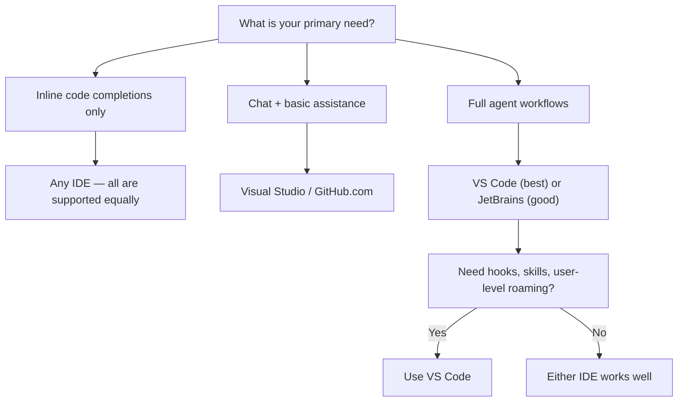

# Supported IDEs & Editors

> **Level:** Beginner → Intermediate
> **Pre-reading:** [Fundamentals · Core Concepts](../fundamentals/01-core-concepts.md)

---

## Overview

GitHub Copilot agents and their primitives are not exclusively a VS Code feature. Support varies by IDE and by primitive type. This page maps each primitive to the editors that support it today, explains the differences, and shows how to configure each one.

---

## Support Matrix

| Primitive                             | VS Code | JetBrains IDEs        | Visual Studio | Vim/Neovim | GitHub.com | CLI            |
|:--------------------------------------|:--------|:----------------------|:--------------|:-----------|:-----------|:---------------|
| **Agents** (`.agent.md`)              | ✅ Full  | ⚠️ Partial (via chat) | ❌             | ❌          | ❌          | ❌              |
| **Instructions** (`.instructions.md`) | ✅ Full  | ✅ `applyTo` supported | ⚠️ Partial    | ❌          | ❌          | ❌              |
| **Prompts** (`.prompt.md`)            | ✅ Full  | ✅ Slash commands      | ⚠️ Partial    | ❌          | ❌          | ❌              |
| **Skills** (`SKILL.md`)               | ✅ Full  | ⚠️ Partial            | ❌             | ❌          | ❌          | ❌              |
| **Copilot Chat**                      | ✅       | ✅                     | ✅             | ❌          | ✅          | ✅ (gh copilot) |
| **Workspace Instructions**            | ✅       | ✅                     | ✅             | ❌          | ✅          | ✅              |
| **Inline Completions**                | ✅       | ✅                     | ✅             | ✅          | N/A        | N/A            |

---

## VS Code — Full Support

VS Code has the most complete implementation of the Copilot agent system. All four primitives are supported, and the `@` picker in chat surfaces agents automatically.

**What works:**

- `@agent-name` picker in Copilot Chat
- Automatic `applyTo` instruction loading when files are opened
- `/prompt-name` slash commands
- Skill loading via description match
- Hooks (`.github/hooks/*.json`)
- User-level roaming via settings sync

**Setup:**

1. Install the [GitHub Copilot Chat](https://marketplace.visualstudio.com/items?itemName=GitHub.copilot-chat) extension
2. Sign in with GitHub credentials
3. Create or clone a repo with `.github/agents/`, `.github/prompts/`, `.github/instructions/`
4. Open Copilot Chat → type `@` to see available agents

**File locations (VS Code):**

| Scope                  | Path                                               |
|:-----------------------|:---------------------------------------------------|
| Workspace agents       | `.github/agents/`                                  |
| Workspace prompts      | `.github/prompts/`                                 |
| Workspace instructions | `.github/instructions/`                            |
| User-level (macOS)     | `~/Library/Application Support/Code/User/prompts/` |
| User-level (Linux)     | `~/.config/Code/User/prompts/`                     |
| User-level (Windows)   | `%APPDATA%\Code\User\prompts\`                     |

---

## JetBrains IDEs — Partial Support

JetBrains IDEs (IntelliJ IDEA, PyCharm, WebStorm, GoLand, Rider, etc.) support GitHub Copilot via the official plugin, but agent features are a subset of what VS Code offers.

**What works:**

- **Copilot Chat** — standard chat, inline suggestions
- **Workspace instructions** — `copilot-instructions.md` and `AGENTS.md` are read
- **Instructions (`applyTo`)** — supported; files matching the glob pattern are auto-loaded
- **Prompts (`.prompt.md`)** — slash commands work in the chat panel
- **`@agent-name` invocation** — works if the agent file is present; tool restrictions are enforced

**What is limited or missing:**

- The `@` picker UI for browsing agents may not show all agents (depends on plugin version)
- Hooks (`.github/hooks/`) — not yet supported
- Skill auto-discovery via description matching — not as reliable as VS Code
- User-level roaming folder — uses a different path and may require manual setup

**Setup:**

1. Install the [GitHub Copilot plugin](https://plugins.jetbrains.com/plugin/17718-github-copilot) from JetBrains Marketplace
2. Sign in via **Settings → GitHub Copilot → Sign In**
3. Restart the IDE
4. Agents in `.github/agents/` are available in the Copilot Chat panel

**JetBrains user-level config path:**

```
~/.config/github-copilot/            (macOS/Linux)
%APPDATA%\GitHub Copilot\            (Windows)
```

---

## Visual Studio (Windows) — Basic Support

Microsoft Visual Studio (the full IDE, not VS Code) supports GitHub Copilot Chat and inline completions, but agent customization is minimal.

**What works:**

- Copilot Chat (general assistant)
- Inline code completions
- Workspace instructions (`copilot-instructions.md`) — read from the repo root or `.github/`

**What does not work:**

- Custom agents (`.agent.md`) — not supported
- Prompts and skills — not supported
- Instructions with `applyTo` — not supported
- Hooks — not supported

**Recommendation:** Use Visual Studio for completions and basic chat. For agent-driven workflows, switch to VS Code or JetBrains.

---

## Vim / Neovim — Completions Only

The [GitHub Copilot Vim plugin](https://github.com/github/copilot.vim) and the [copilot.lua](https://github.com/zbirenbaum/copilot.lua) Neovim plugin provide inline ghost-text completions only.

**What works:**

- Ghost-text inline completions
- Basic `@workspace` context (via LSP in some configurations)

**What does not work:**

- All agent primitives (agents, instructions, prompts, skills, hooks)
- Copilot Chat panel

**Recommendation:** Vim/Neovim is optimal for power users who want completions without leaving the terminal. For any agent-based workflow, a fully supported IDE is required.

---

## GitHub.com — Chat Without Local Context

GitHub Copilot is available at [github.com](https://github.com) in the chat panel (Copilot icon in the top navigation).

**What works:**

- Copilot Chat with `@github` context — it can read your repos, issues, PRs, code
- Workspace instructions from `copilot-instructions.md` in the repo
- General coding assistance

**What does not work:**

- Local file editing
- Custom agents (`@agent-name`)
- Prompts, skills, hooks

**Best for:** Quick questions about a repo without opening an IDE, reviewing PRs, searching across repos.

---

## GitHub CLI — `gh copilot`

The GitHub CLI includes `gh copilot` for terminal-based assistance.

**What works:**

- `gh copilot explain` — explain a shell command
- `gh copilot suggest` — suggest a shell command for a task
- Copilot Chat via terminal

**What does not work:**

- Agents, instructions, prompts, skills

**Install:**

```bash
brew install gh             # macOS
gh extension install github/gh-copilot
gh copilot suggest "list all docker containers using more than 1GB RAM"
```

---

## Choosing the Right IDE for Agent Work



---

## Syncing Agents Across IDEs

Because agents are stored in `.github/` and committed to Git, any team member on any supported IDE gets the same agent definitions automatically on `git pull`. The agent files themselves are IDE-agnostic — only the UI that surfaces them differs.

**What IS IDE-specific:**

- The `@` picker UI appearance
- User-level roaming paths
- Hook support
- Skill discovery reliability

**What is NOT IDE-specific (works everywhere):**

- `.github/copilot-instructions.md`
- `.github/agents/*.agent.md` file content
- `.github/prompts/*.prompt.md` file content
- `.github/instructions/*.instructions.md`

---

## Interview Q&A

??? question "Can I use agents in JetBrains without VS Code?"
    Yes. JetBrains IDEs support `@agent-name` invocation in the Copilot Chat panel. The main limitations are: hooks are not enforced, and skill discovery via description matching is less reliable. For most use cases — asking an agent to write docs, review code, or generate tests — JetBrains works well.

??? question "Will my team's agents work if someone uses VS Code and someone else uses IntelliJ?"
    Yes. The agent files in `.github/agents/` are shared through Git. Both IDEs read the same files. The experience may differ slightly (VS Code has a richer `@` picker), but the agent's instructions and tool restrictions are applied consistently.

??? question "Do hooks work in JetBrains?"
    Not yet (as of April 2026). Hooks defined in `.github/hooks/` are only enforced in VS Code. JetBrains users get the agent's instructions but not the deterministic shell-command enforcement.

??? question "Can I use agents in GitHub Codespaces?"
    Yes. GitHub Codespaces runs VS Code in the browser (or connected to your local VS Code). All agent features available in VS Code are available in Codespaces, including the full `@` picker and hooks.

??? question "Is there a way to use agents in the terminal without an IDE?"
    Not directly through the current `gh copilot` CLI. The gh CLI supports suggestions and explanations but not custom agents. A third-party tool like `aider` supports Claude and GPT models with custom system prompts, but that is a different product — not GitHub Copilot agents natively.
