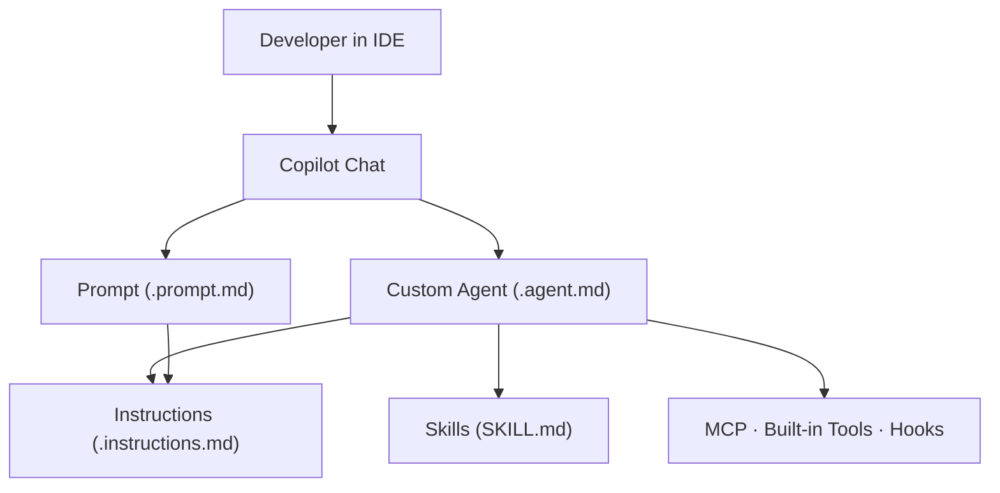

# GitHub Copilot Agents Hub

> Your single source of truth for building, managing, and deploying custom GitHub Copilot agents, instructions, skills, and prompts across your team.

---

## Quick Start

Get up and running in 5 minutes:

```bash
# 1. Clone the repository
git clone https://github.com/YOUR-ORG/copilot-agents-hub.git
cd copilot-agents-hub

# 2. Run setup (creates symlinks to VS Code config)
bash scripts/setup-vscode.sh

# 3. Restart VS Code
# Cmd+Shift+P → Reload Window

# 4. Open Copilot Chat
# Cmd+Shift+I → Type @ → See agents
```

Done! You now have access to all custom agents across your machines.

---

## What This Guide Covers

This documentation is organized into increasing levels of depth:

| Level | What You Will Learn |
|---|---|
| [Fundamentals](fundamentals/01-core-concepts.md) | What agents, instructions, skills, and prompts are and why they exist |
| [Clarification](fundamentals/02-copilot-agents-vs-agentic-ai.md) | How Copilot agents differ from broader agentic AI systems |
| [Slash Commands vs Agents](fundamentals/03-slash-commands-vs-agents.md) | Understand `/` (one-off tasks) vs `@` (persistent agent context) |
| [Intermediate](intermediate/01-working-together.md) | How the primitives compose, configuration patterns, and real-world use cases |
| [Advanced](advanced/01-advanced-patterns.md) | Hooks, multi-agent workflows, scoping, tool restrictions, and anti-patterns |
| [IDE Compatibility](ide-compatibility/01-overview.md) | Which editors support each primitive and how to configure them |
| [Reference Guides](reference/01-agents-guide.md) | Creating your own agents, skills, prompts, and instructions |

---

## Who Should Read This

- **New to Copilot agents** — start at [Fundamentals](fundamentals/01-core-concepts.md)
- **Confused about "agents" vs "agentic AI"** — read [Clarification](fundamentals/02-copilot-agents-vs-agentic-ai.md)
- **Wondering about `/slash` vs `@agent`** — see [Slash Commands vs Agents](fundamentals/03-slash-commands-vs-agents.md)
- **Building team workflows** — jump to [Intermediate Concepts](intermediate/01-working-together.md)
- **Architecting complex pipelines** — go straight to [Advanced Patterns](advanced/01-advanced-patterns.md)
- **Using JetBrains or other IDEs** — check [IDE Compatibility](ide-compatibility/01-overview.md)
- **Creating custom agents** — see [Reference Guides](reference/01-agents-guide.md)

---

## Quick Mental Model



---

## Repository Structure

```
copilot-agents-hub/
├── .github/                      ← Code only (no docs)
│   ├── agents/                   ← Custom agent definitions (.agent.md)
│   ├── prompts/                  ← Reusable prompt templates (.prompt.md)
│   ├── instructions/             ← File-pattern instructions (.instructions.md)
│   ├── skills/                   ← Skill bundles (SKILL.md + assets)
│   ├── workflows/                ← GitHub Actions workflows
│   └── copilot-instructions.md   ← Workspace-level rules
├── docs/                         ← MkDocs documentation
│   ├── fundamentals/             ← Core concepts
│   ├── intermediate/             ← Working together patterns
│   ├── advanced/                 ← Advanced patterns
│   ├── ide-compatibility/        ← IDE setup guides
│   ├── reference/                ← Creating agents, skills, prompts, instructions
│   ├── setup.md                  ← Detailed setup guide
│   ├── agents-index.md           ← Agent registry
│   └── index.md                  ← This file
├── .vscode/                      ← VS Code workspace settings
├── scripts/                      ← Automation scripts
└── mkdocs.yml                    ← Documentation configuration
```

---

## Running the Docs Locally

```bash
# One-liner (installs mkdocs-material if missing, then serves)
bash scripts/serve-docs.sh
```

Or manually:

```bash
pip install -r requirements.txt
mkdocs serve
# → http://127.0.0.1:8000
```

To build a static site for deployment:

```bash
mkdocs build
# Output goes to site/
```

---

## Key Components

### 🤖 Agents (`.agent.md`)
Specialized AI personas for specific tasks. Use in Copilot Chat with `@agent-name`.

**Current agents:**
- ✅ `mkdocs-content` — MkDocs documentation specialist

### 📋 Instructions (`.instructions.md`)
Auto-applied file-level style guides. Appear automatically when editing matching file types.

### 🛠️ Skills (Bundled reference libraries)
Templates, configs, and examples. Access with `/skill-name` in Copilot Chat.

**Current skills:**
- ✅ `mkdocs-docs` — Complete MkDocs setup library

### 📝 Prompts (`.prompt.md`)
Parameterized single-task workflows. Access with `/prompt-name` in Copilot Chat.

---

## Next Steps

1. **Complete setup** — Run `bash scripts/setup-vscode.sh`
2. **Test it out** — Open Copilot Chat, type `@`, select an agent
3. **Read about your domain** — Pick a section from "What This Guide Covers" above
4. **Create your first agent** — See [Reference Guides](reference/01-agents-guide.md)
5. **Sync to other machines** — Push to GitHub, clone elsewhere, run setup script

---

## Learning Path

| Step | What | Time |
|------|------|------|
| 1 | **Quick Start** (above) | 5 mins |
| 2 | [Fundamentals](fundamentals/01-core-concepts.md) | 10 mins |
| 3 | [Setup Guide](setup.md) | 5 mins |
| 4 | [Agents Index](agents-index.md) | 2 mins |
| 5 | [Create Your First Agent](reference/01-agents-guide.md) | 15 mins |
| 6 | [Sync Across Machines](setup.md#update-and-sync) | 5 mins |

---

## Validate Before Pushing to GitHub

```bash
bash scripts/validate-agents.sh
```

Checks:
- ✓ All agents have valid YAML
- ✓ Agent names match filenames
- ✓ No duplicate names
- ✓ Configuration is complete
