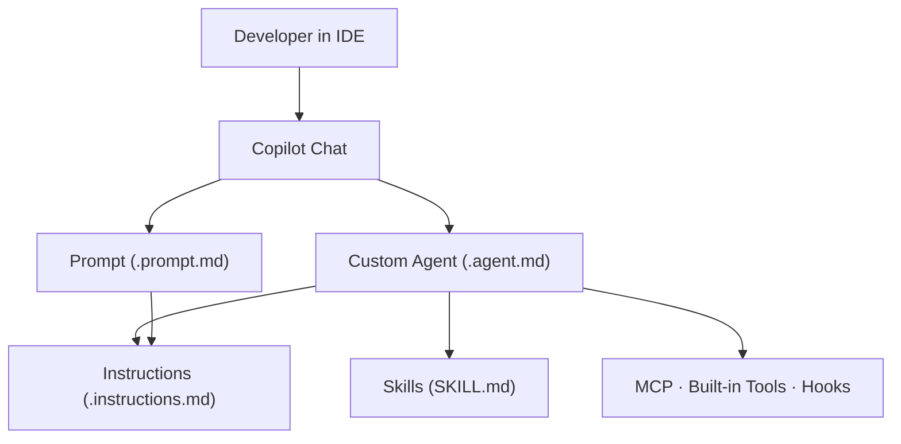

# GitHub Copilot Agents Hub

> Welcome to the Copilot Agents Hub — your single source of truth for building, managing, and deploying custom GitHub Copilot agents, instructions, skills, and prompts across your team.

---

## What This Guide Covers

This documentation is organized into increasing levels of depth:

| Level | What You Will Learn |
|---|---|
| [Fundamentals](fundamentals/01-core-concepts.md) | What agents, instructions, skills, and prompts are and why they exist |
| [Clarification](fundamentals/02-copilot-agents-vs-agentic-ai.md) | How Copilot agents differ from broader agentic AI systems |
| [Slash Commands vs Agents](fundamentals/03-slash-commands-vs-agents.md) | Understand `/` (one-off tasks) vs `@` (persistent agent context) |
| [Intermediate](intermediate/01-working-together.md) | How the primitives compose, configuration patterns, and real-world use cases |
| [Advanced](advanced/01-advanced-patterns.md) | Hooks, multi-agent workflows, scoping, tool restrictions, and anti-patterns |
| [IDE Compatibility](ide-compatibility/01-overview.md) | Which editors support each primitive and how to configure them |

---

## Quick Mental Model



---

## Who Should Read This

- **New to Copilot agents** — start at [Fundamentals](fundamentals/01-core-concepts.md)
- **Confused about "agents" vs "agentic AI"** — read [Clarification](fundamentals/02-copilot-agents-vs-agentic-ai.md)
- **Wondering about `/slash` vs `@agent`** — see [Slash Commands vs Agents](fundamentals/03-slash-commands-vs-agents.md)
- **Building team workflows** — jump to [Intermediate Concepts](intermediate/01-working-together.md)
- **Architecting complex pipelines** — go straight to [Advanced Patterns](advanced/01-advanced-patterns.md)
- **Using JetBrains or other IDEs** — check [IDE Compatibility](ide-compatibility/01-overview.md)

---

## Repository Layout

```
copilot-agents-hub/
├── .github/
│   ├── agents/          ← Custom agent definitions (.agent.md)
│   ├── prompts/         ← Reusable prompt templates (.prompt.md)
│   ├── instructions/    ← File-pattern instructions (.instructions.md)
│   ├── skills/          ← Skill bundles (SKILL.md + assets)
│   └── hooks/           ← Lifecycle hooks (.json)
├── docs/                ← This documentation
├── mkdocs.yml           ← MkDocs site configuration
└── scripts/
    ├── setup-vscode.sh  ← Sync agents to VS Code user profile
    ├── validate-agents.sh
    └── serve-docs.sh    ← Run docs site locally
```

---

## Running the Docs Locally

```bash
# One-liner (installs mkdocs-material if missing, then serves)
bash scripts/serve-docs.sh
```

Or manually:

```bash
pip install mkdocs-material
mkdocs serve
# → http://127.0.0.1:8000
```

To build a static site for deployment:

```bash
mkdocs build
# Output goes to site/
```
