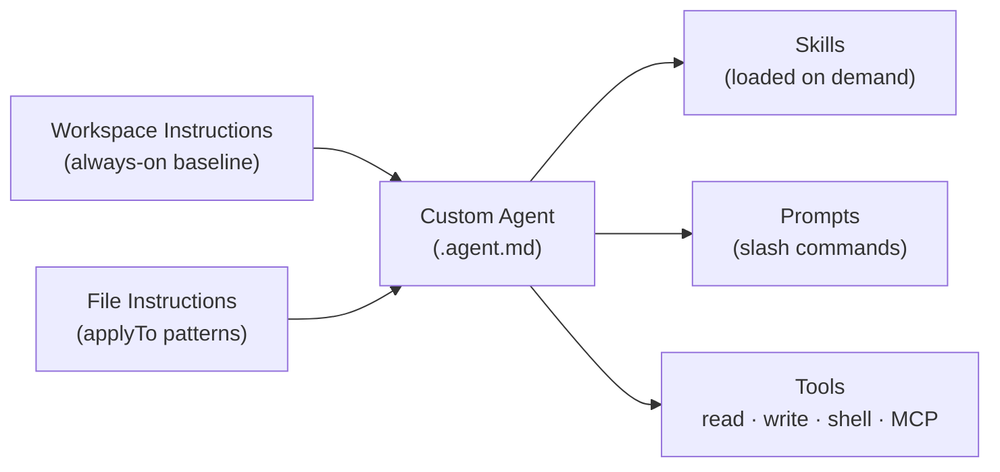

# How the Primitives Work Together

> **Level:** Intermediate
> **Pre-reading:** [Fundamentals · Core Concepts](../fundamentals/01-core-concepts.md)

---

## The Composition Model

No single primitive covers every scenario. In practice, a well-structured Copilot setup layers all four primitives so they reinforce each other.



**How each layer is activated:**

- **Workspace instructions** — loaded for every conversation in the repo
- **File instructions** — loaded when a matching file is open
- **Agent** — activated when the user types `@agent-name`
- **Skills** — loaded when triggered by description match or explicit reference
- **Prompts** — invoked via `/prompt-name`

---

## A Real-World Example: Documentation Team Setup

Imagine a documentation team working on a MkDocs site. Here is how all four primitives would be layered:

### Layer 1 — Workspace instructions (`.github/copilot-instructions.md`)

```markdown
This is a MkDocs documentation project.
All content lives under docs/.
Always use Material theme admonition syntax.
Commit messages must use: Add:, Update:, Remove: prefixes.
```

### Layer 2 — File instructions (`.github/instructions/mkdocs-style.instructions.md`)

```yaml
---
applyTo: "docs/**/*.md"
---
Always add a blank line before bullet lists.
Never use pipe | in Mermaid node labels — use middle dot · instead.
Every file ends with the abbreviations include.
```

### Layer 3 — Custom agent (`.github/agents/01-mkdocs-content.agent.md`)

```yaml
---
name: mkdocs-content
description: "Use when: creating MkDocs articles, managing doc structure, writing section summaries"
tools:
  - read_file
  - create_file
  - replace_string_in_file
  - file_search
  - grep_search
---
You are a MkDocs content specialist.
Always follow the two-tier content model: section summary + deep-dive articles.
```

### Layer 4 — Skill (`.github/skills/mkdocs-docs/SKILL.md`)

Loaded on demand when the agent needs detailed template knowledge for creating new article types.

---

## Scoping: Workspace vs User Level

| Scope | Location | Who Sees It | Version Controlled |
|---|---|---|---|
| Workspace | `.github/agents/`, `.github/prompts/`, `.github/instructions/` | All team members | Yes — committed to Git |
| User | `~/…/Code/User/prompts/` | Only you, all workspaces | Via VS Code settings sync |

**Rule of thumb:**

- Shared conventions, team workflows → workspace scope
- Personal shortcuts, individual preferences → user scope

---

## Use Cases by Category

### Software Development Agents

| Use Case | Agent Role | Tools Needed |
|---|---|---|
| Code review | Read-only reviewer — no write access | `read_file`, `grep_search`, `semantic_search` |
| Test writer | Reads source, writes test files | `read_file`, `create_file`, `replace_string_in_file` |
| Refactoring assistant | Reads and rewrites code | `read_file`, `replace_string_in_file`, `run_in_terminal` |
| Dependency auditor | Scans manifests, reports issues | `file_search`, `grep_search`, `fetch_webpage` |
| CI debugger | Reads logs, suggests fixes | `read_file`, `get_errors`, `run_in_terminal` |

### Documentation Agents

| Use Case | Agent Role | Tools Needed |
|---|---|---|
| MkDocs author | Creates and updates doc files | `read_file`, `create_file`, `replace_string_in_file` |
| API doc generator | Reads source, writes OpenAPI docs | `read_file`, `create_file`, `semantic_search` |
| Changelog writer | Reads git diff, writes changelog | `run_in_terminal`, `create_file` |

### Data & DevOps Agents

| Use Case | Agent Role | Tools Needed |
|---|---|---|
| SQL schema reviewer | Reads migration files, checks for issues | `read_file`, `grep_search` |
| Infrastructure linter | Validates Terraform/Helm files | `read_file`, `run_in_terminal` |
| Observability assistant | Reads logs and metrics queries | `read_file`, `fetch_webpage` |

---

## Anatomy of a Well-Formed Agent File

Every `.agent.md` file has two parts separated by a `---` fence:

```
┌──────────────────────────────────────────┐
│  YAML Frontmatter (machine-readable)     │
│  ─────────────────────────────────────   │
│  name: my-agent                          │
│  description: "Use when: ..."            │
│  tools: [...]                            │
└──────────────────────────────────────────┘
┌──────────────────────────────────────────┐
│  Markdown Body (human-readable prompt)   │
│  ─────────────────────────────────────   │
│  You are a specialist in X.              │
│  Always do Y.                            │
│  Never do Z.                             │
└──────────────────────────────────────────┘
```

**Frontmatter fields:**

| Field | Required | Purpose |
|---|---|---|
| `name` | Yes | Identifier used in `@name` — must match filename slug |
| `description` | Yes | Discovery surface — what triggers this agent |
| `tools` | No | Restrict which tools are available; omit to allow all |
| `model` | No | Pin to a specific model (e.g., `gpt-4o`) |

---

## Designing for Reliability

**Be explicit about what the agent should NOT do.**

Copilot will attempt any task the user asks, even if it falls outside the agent's intent. Explicitly listing prohibited actions narrows scope:

```markdown
Do NOT run shell commands unless the user explicitly requests it.
Do NOT modify files outside the docs/ directory.
Do NOT suggest changes to mkdocs.yml without explaining the impact.
```

**Give the agent decision rules, not just facts.**

Instead of: _"We use Material theme"_

Write: _"When choosing admonition styles, always use Material theme syntax (`!!! note`) not standard blockquotes."_

**Include examples in the agent body.**

```markdown
## Example: Creating a new section

User: "Add a section on authentication"
You should:
1. Check existing sections with file_search
2. Determine the next section number
3. Create NN-authentication.md using the section summary template
4. Offer to create deep-dive placeholders
```

---

## Interview Q&A

??? question "When should I use an agent vs just a prompt?"
    Use a prompt when the task is short, self-contained, and parameterized — like generating a boilerplate file. Use an agent when the task needs persistent context, multiple steps, tool use, or specialized decision rules that must survive across turns.

??? question "Can I have multiple agents active at the same time?"
    Only one `@agent` is active per conversation turn. However, an agent can spawn subagents (using the `runSubagent` tool) to delegate isolated tasks, then synthesize the results.

??? question "How do I prevent an agent from modifying production files?"
    Restrict the `tools` list in frontmatter to exclude `run_in_terminal`, and add explicit rules in the agent body: "Do NOT modify files outside the src/ directory."

??? question "What is the difference between workspace instructions and an agent's body prompt?"
    Workspace instructions (copilot-instructions.md) apply to every conversation in the repo regardless of which agent is active. An agent's body prompt applies only when that specific agent is invoked — and it can override workspace instructions for that session.

??? question "How many tools should I give an agent?"
    Fewer is safer. Start with the minimum required tools. Add more only when you discover the agent cannot complete its task. Over-provisioned agents are harder to reason about and more likely to take unintended actions.
