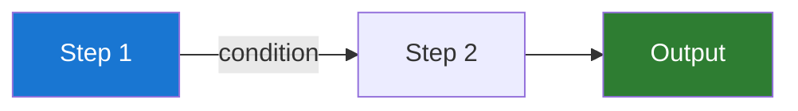
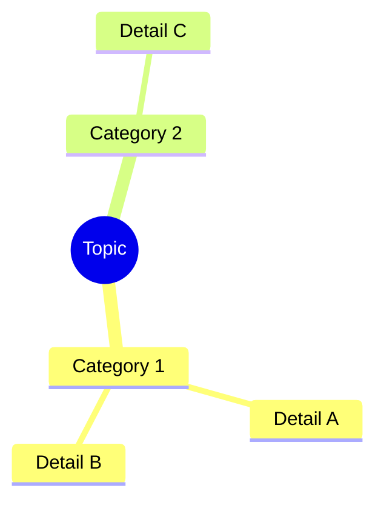
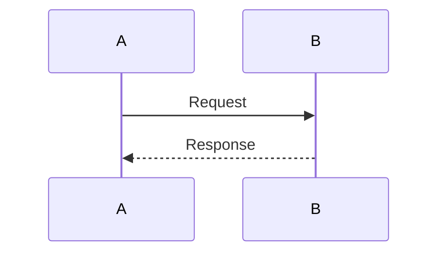

# Copilot Instructions for Learning Site Template

> Use this file to guide GitHub Copilot when writing and scaffolding content for this learning site.

---

## Overall Style & Tone

When writing or suggesting content for this site:

### Tone
- **Clear and accessible** — Explain concepts simply, avoid unnecessary jargon
- **Practical** — Include real examples and use cases
- **Confident** — Speak with authority, but acknowledge complexity
- **Encouraging** — This is a learning resource, not a gatekeeping one

### Structure
- **Progressive** — Each section builds on the last
- **Self-contained** — Each article can stand alone (but link to prerequisites)
- **Interactive** — Use Mermaid diagrams, math, collapsible Q&A blocks
- **Detailed but digestible** — Long enough to be valuable, short enough to read in one sitting

---

## Article Writing Rules

### Every Article Must Have

1. **Level badge** — `🟢 Beginner | 🟡 Intermediate | 🔴 Advanced`
2. **Pre-reading links** — Links to prerequisite articles
3. **Plain-language intro** — 2–3 sentences before using jargon
4. **Clear explanation** — Main concept with examples
5. **Diagram** — At least 1 Mermaid diagram per deep-dive
6. **Interview Q&A** — 2–3 collapsible `??? question` blocks
7. **Abbreviations footer** — `--8<-- "_abbreviations.md"`

### Article Templates

Use these templates as the basis for all new articles:

- **Fundamentals:** Follow [01-core-concepts.md](../docs/01-fundamentals/01-core-concepts.md)
- **Intermediate:** Follow [01-building-blocks.md](../docs/02-intermediate/01-building-blocks.md)
- **Advanced:** Follow [01-advanced-patterns.md](../docs/03-advanced/01-advanced-patterns.md)

### Markdown Features to Use

| Feature | Syntax | When to Use |
|---|---|---|
| **Abbreviation** | `*[TERM]: Definition` in `_abbreviations.md` | Define technical terms |
| **Mermaid diagram** | ` ```mermaid ... ``` ` | Visualize processes, architectures, flows |
| **Math equation** | ` $$ formula $$ ` | Explain mathematical concepts |
| **Collapsible Q&A** | ` ??? question "Q?" ` | Interview prep, common questions |
| **Admonition** | ` !!! note "Title" ` | Highlights, tips, warnings |
| **Tabs** | ` === "Tab 1" ` | Compare approaches, different languages |
| **Code block** | ` ```python ... ``` ` | Working code examples |

### Best Practices

✅ **DO:**
- Start with plain language before jargon
- Use tables for comparisons (never bullet lists)
- Include worked examples
- Explain *why*, not just *how*
- Link to related concepts
- Keep paragraphs short
- Add blank lines before lists

❌ **DON'T:**
- Assume prior knowledge
- Use overly academic language
- Provide code without explanation
- Write very long paragraphs
- Forget footnote citations
- Skip the abbreviations footer
- Use complex formatting that breaks on mobile

---

## Mermaid Diagram Guidelines

### Color Scheme

Use the PCF color scheme (blue + orange):
- **Blue (#1976d2):** Primary, main flow
- **Orange (#ff9800):** Accent, highlights, attention
- **Green (#2e7d32):** Success, positive
- **Red (#c62828):** Danger, errors

### Diagram Types & Examples

**Flowchart (most common):**


**Mind Map (for hierarchies):**


**Sequence Diagram (for interactions):**


---

## Math Equations

### Inline Math
Use `$$...$$ ` for display equations.

Always **explain each symbol** in a table:

$$
\text{result} = \frac{numerator}{denominator}
$$

| Symbol | Meaning |
|---|---|
| `result` | What we're calculating |
| `numerator` | [explanation] |
| `denominator` | [explanation] |

### Best Practices

✅ Simple, meaningful equations  
✅ Explained symbols  
✅ Worked examples  
✗ Complex proofs  
✗ Unexplained notation  

---

## Abbreviations Management

### Adding New Terms

When you use a technical term for the first time:
1. Add it to `docs/_abbreviations.md`
2. Use the format: `*[TERM]: Short definition (1-2 sentences)`
3. Provide practical definition, not overly academic

### Examples

```markdown
*[API]: Application Programming Interface — a set of rules for how programs communicate.
*[ACID]: Atomicity, Consistency, Isolation, Durability — four properties guaranteeing reliable database transactions.
```

---

## Interview Q&A Format

Every deep-dive article should include interview-style questions:

```markdown
??? question "Interview Q: [Specific question]?"
    **Model Answer:**  
    [2–4 sentence clear, precise answer using correct terminology]
    
    **Why this matters:**  
    [Context on why this question matters for interviews/practice]
```

---

## Content Checklist

Before marking an article as complete, verify:

- [ ] Level badge present (🟢/🟡/🔴)
- [ ] Pre-reading links included
- [ ] Plain-language intro (2–3 sentences)
- [ ] Main content explained clearly
- [ ] At least 1 Mermaid diagram
- [ ] Math explained (if applicable)
- [ ] At least 2–3 interview Q&A blocks
- [ ] Abbreviations footer included
- [ ] Links to next section
- [ ] No typos or grammar issues
- [ ] Mobile-friendly formatting
- [ ] Code examples work

---

## Content Gaps to Fill In

Check the template articles for `[BRACKETS]` placeholders:

- `[Topic Name]` — Replace with actual topic
- `[Key Concept]` — Define specific concepts for your domain
- `[Real Example]` — Add concrete, relatable examples
- `[Code Example]` — Provide working code
- `[Interview Q]` — Add domain-specific questions

---

## Guidelines by Domain

### For Database/Distributed Systems Topics
- Emphasize ACID/BASE/CAP
- Include consistency models
- Use sequence diagrams for node interactions
- Cover failure scenarios
- Include performance trade-offs

### For Machine Learning Topics
- Include math formulas with explanations
- Use visualizations for model architectures
- Provide intuition before equations
- Include hands-on Python examples
- Cover common pitfalls

### For Architecture Topics
- Use system design diagrams
- Cover scalability patterns
- Include deployment strategies
- Discuss monitoring/observability
- Compare architectural approaches

---

## Review Checklist

When reviewing content, ensure:

1. **Clarity** — Can a beginner understand this?
2. **Accuracy** — Is the technical content correct?
3. **Completeness** — Does it follow the template structure?
4. **Engagement** — Does it have diagrams, examples, Q&A?
5. **Consistency** — Does it match the guide's tone/style?
6. **Mobile-friendly** — Does it render well on phones?

---

## Questions?

Refer to:
- [README.md](../README.md) — Overview and features
- [GETTING_STARTED.md](../docs/GETTING_STARTED.md) — How the guide is structured
- [Quick Reference](../docs/reference/01-quick-reference.md) — Markdown features and syntax

---

**Happy writing! 📝**
