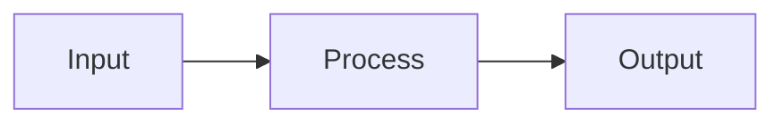

# Learning Site Template

A **complete, production-ready template** for building beautiful technical learning sites with MkDocs Material.

## ✨ What Makes This Template Special

Built from the best practices across 15+ real learning projects:
- 🎨 **Professional theme** - Material Design with carefully chosen color scheme (light + dark modes)
- 📊 **Rich diagrams** - Mermaid graphs, mind maps, flowcharts with optimized rendering
- 📐 **Math equations** - KaTeX/MathJax support with proper spacing
- 📝 **Feature-rich markdown** - Abbreviations with hover tooltips, collapsible Q&A blocks, tables, code samples
- 🎯 **Progressive structure** - Fundamentals → Intermediate → Advanced with clear learning paths
- 🤖 **Agent-powered** - Built-in agents to scaffold new pages, generate content
- 🛠️ **Customizable** - CSS/JS/config pre-optimized, ready to adapt

## 📦 Quick Start

### 1. Clone or use as template
```bash
git clone <this-repo> my-learning-site
cd my-learning-site
```

### 2. Install dependencies
```bash
pip install -r requirements.txt
# or with venv
python3 -m venv venv
source venv/bin/activate  # macOS/Linux
pip install -r requirements.txt
```

### 3. Update configuration
Edit `mkdocs.yml`:
- Change `site_name` to your topic
- Update `site_description`
- Add your site URL
- Modify nav structure if needed

### 4. Build & serve
```bash
mkdocs serve
# Open http://localhost:8000
```

## 📁 Project Structure

```
learning-site-template/
├── mkdocs.yml              # All config (theme, extensions, nav)
├── requirements.txt        # Python dependencies
├── README.md              # This file
├── .github/
│   ├── agents/            # Custom agents for content generation
│   └── skills/            # Reusable skill definitions
├── docs/
│   ├── index.md           # Home page with learning path diagram
│   ├── GETTING_STARTED.md # Prerequisites & navigation guide
│   ├── _abbreviations.md  # 30+ domain-specific terms with definitions
│   ├── css/
│   │   └── extra.css      # Custom styling (details, abbr, math, mermaid)
│   ├── js/
│   │   ├── mathjax.js     # Math rendering config
│   │   ├── mermaid-init.js # Diagram rendering + theme toggle
│   │   └── theme-toggle.js # Dark/light mode persistence
│   ├── 00-introduction/   # Overview & learning path
│   ├── 01-fundamentals/   # Core concepts (beginner level)
│   ├── 02-intermediate/   # Building blocks (intermediate level)
│   ├── 03-advanced/       # Patterns & production (advanced)
│   └── reference/         # Quick lookup & cheatsheets
└── site/                  # Built HTML (gitignored)
```

## 🎨 Theme & Features

### Color Scheme (Material Theme)
- **Primary**: Blue (professional, calm)
- **Accent**: Orange (highlights, attention)
- **Modes**: Automatic light/dark toggle with persistence

### Built-in Features
✅ Responsive navigation with tabs  
✅ Instant page loading  
✅ Code block copy buttons  
✅ Search with highlighting  
✅ Mobile-friendly layout  

## 📝 Writing Content

### Every Article Should Have

1. **Level badge** - Beginner / Intermediate / Advanced
2. **Plain-language intro** - 2-3 sentences before jargon
3. **Diagram** - At least 1 Mermaid diagram per deep-dive
4. **Math** - Equations where applicable (optional)
5. **Q&A blocks** - 2-3 interview-style questions
6. **Abbreviations** - End with `--8<-- "_abbreviations.md"`

### Example Article Structure
```markdown
# My Topic — Deep Dive

> **Level:** Beginner | Intermediate | Advanced

## What Is This?

Plain language explanation (2-3 sentences).

## How It Works



## The Math

$$
formula = \frac{numerator}{denominator}
$$

## Interview Questions

??? question "Why is this important?"
    Your answer here.

--8<-- "_abbreviations.md"
```

## 🤖 Using Agents

Scaffold new articles with built-in agents:

```
/fill-article
Topic: My Learning Topic
Section: Fundamentals
Date: 2025-04-28
```

See `.github/agents/` for details.

## 📚 Markdown Features Supported

| Feature | Syntax | Example |
|---------|--------|---------|
| **Abbreviation** | `*[TERM]: Definition` | Hover over underlined words |
| **Collapsible Q&A** | `??? question "Q?"` | Interview-style blocks |
| **Mermaid diagram** | ` ```mermaid ... ``` ` | Graphs, flowcharts, mind maps |
| **Math equation** | `$$formula$$` | Inline or block math |
| **Code highlight** | ` ```python ... ``` ` | Syntax highlighting |
| **Admonition** | `!!! note "Title"` | Info/warning/danger blocks |
| **Tabs** | `=== "Tab 1"` | Tabbed content |
| **Tables** | Standard markdown | Full-featured tables |

## 🌙 Dark Mode

The template includes automatic dark/light mode toggle:
- **Light mode**: Clean, high contrast (good for printing)
- **Dark mode**: Eye-friendly (blue + orange accent)
- **Persistent**: Your preference is saved across sessions

## 🚀 Deployment

To deploy to GitHub Pages or similar:

1. **Build the site**
   ```bash
   mkdocs build
   ```

2. **Deploy `site/` folder** to your hosting (GitHub Pages, Netlify, Vercel, etc.)

3. **GitHub Actions example** (add to `.github/workflows/deploy.yml`)
   ```yaml
   - name: Build MkDocs
     run: mkdocs build
   - name: Deploy
     uses: peaceiris/actions-gh-pages@v3
     with:
       github_token: ${{ secrets.GITHUB_TOKEN }}
       publish_dir: ./site
   ```

## 🔧 Customization

### Change Colors
Edit `mkdocs.yml` theme.palette:
```yaml
- scheme: default
  primary: blue        # Change this
  accent: orange      # Or this
```

Available colors: red, pink, purple, deep-purple, indigo, blue, light-blue, cyan, teal, green, light-green, lime, yellow, amber, orange, deep-orange, brown, grey, blue-grey, white.

### Add Custom CSS
Edit `docs/css/extra.css` - it already includes:
- Abbreviation styling (dotted underline)
- Math block spacing
- Mermaid diagram centering
- Detail/summary styling
- Dark mode overrides

### Add Custom JavaScript
Create `docs/js/custom.js` and add to `mkdocs.yml`:
```yaml
extra_javascript:
  - js/custom.js
```

## 📖 Learning Resources

- [MkDocs Documentation](https://www.mkdocs.org/)
- [Material Theme Guide](https://squidfunk.github.io/mkdocs-material/)
- [Mermaid Diagram Syntax](https://mermaid.js.org/intro/)
- [MathJax Reference](https://docs.mathjax.org/)
- [Markdown Extensions](https://python-markdown.github.io/extensions/)

## 📄 License

MIT License - use freely for your learning sites!

---

**Happy learning! 🚀**

Built from consolidating best practices across 15+ real projects:  
PCF_Learning, aiDevGuide, Kafka-Learning, mlDLGuide, CassandraLearning, and more.
