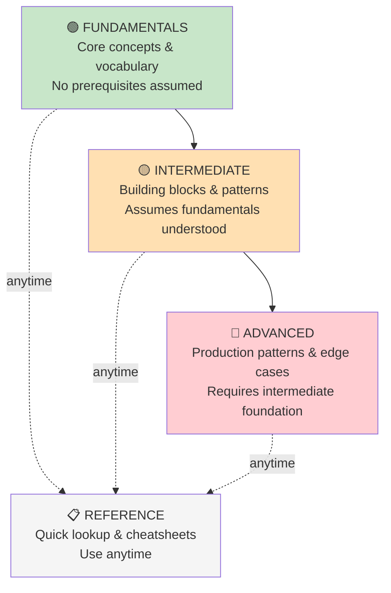

# Learning Path Overview

> Understand how this guide is structured and the recommended progression through topics.

---

## Progressive Learning Structure

This guide follows a **three-tier learning model**:

---

## The Three Tiers Explained

### 🟢 Fundamentals — Build Strong Foundations

| Topic | Time | Focus |
|---|---|---|
| **Core Concepts** | 30–40 min | What is this? Why does it matter? |
| **Key Principles** | 30–40 min | How does it work at a basic level? |

**Entry Level:** No prior knowledge required  
**Prerequisites:** Basic comfort with technical concepts  
**Goal:** Understand core terminology and concepts  
**Outcome:** You can explain the basics to someone else

---

### 🟡 Intermediate — Combine & Apply

| Topic | Time | Focus |
|---|---|---|
| **Building Blocks** | 40–50 min | How do concepts fit together? |
| **Practical Applications** | 40–50 min | How do I use this in real scenarios? |

**Entry Level:** Must understand fundamentals  
**Prerequisites:** Complete fundamentals section  
**Goal:** Apply concepts to real problems  
**Outcome:** You can use this effectively in projects

---

### 🔴 Advanced — Master Nuances

| Topic | Time | Focus |
|---|---|---|
| **Advanced Patterns** | 50–60 min | What are expert-level strategies? |
| **Production Considerations** | 50–60 min | How do I handle complex scenarios? |

**Entry Level:** Expert-level concepts  
**Prerequisites:** Complete intermediate section  
**Goal:** Master edge cases and optimization  
**Outcome:** You're a practitioner who can teach others

---

### 📋 Reference — Quick Lookup

Use the [Quick Reference](../reference/01-quick-reference.md) section **anytime** for:
- ✓ Terminology definitions
- ✓ Syntax examples
- ✓ Common patterns
- ✓ Interview Q&A

No prerequisites — jump in whenever you need fast answers.

---

## Recommended Reading Order

### If You're Completely New

**Path: Fundamentals → Intermediate → Advanced**

```mermaid
graph LR
    A["📍 START<br/>Getting Started"] 
    A --> B["🟢 Core Concepts"]
    B --> C["🟢 Key Principles"]
    C --> D{{"Ready for<br/>Intermediate?"}}
    D -->|Yes| E["🟡 Building Blocks"]
    D -->|Review| F["📋 Cheatsheet"]
    F --> E
    E --> G["🟡 Practical Apps"]
    G --> H{{"Ready for<br/>Advanced?"}}
    H -->|Yes| I["🔴 Patterns"]
    H -->|Review| J["📋 Cheatsheet"]
    J --> I
    I --> K["🔴 Production"]
    K --> L["✅ MASTERY"]
    
    style A fill:#bbdefb
    style B fill:#c8e6c9
    style C fill:#c8e6c9
    style E fill:#ffe0b2
    style G fill:#ffe0b2
    style I fill:#ffcdd2
    style K fill:#ffcdd2
    style L fill:#a5d6a7
```

**Time commitment:** ~6–8 hours (read at your own pace)

### If You're Familiar With Basics

**Path: Fundamentals (skim) → Intermediate → Advanced**

1. Quickly skim **[Core Concepts](01-core-concepts.md)** to make sure you're aligned on terminology
2. Deep dive into **[Intermediate: Building Blocks](../02-intermediate/01-building-blocks.md)**
3. Continue to **[Advanced](../03-advanced/01-advanced-patterns.md)**

### If You're an Expert Looking for Specifics

**Path: Use search or jump directly**

1. Use the **search box** to find specific topics
2. Jump directly to **[Advanced](../03-advanced/01-advanced-patterns.md)** sections
3. Reference [Quick Reference](../reference/01-quick-reference.md) for definitions

---

## How to Know You're Ready to Move Forward

### Before Starting Intermediate

✓ You can explain core concepts in your own words  
✓ You understand the key principles  
✓ You can answer most of the interview Q&A in fundamentals  

**Not ready?** That's OK — re-read a section or spend more time with the fundamentals.

### Before Starting Advanced

✓ You can apply intermediate concepts to real scenarios  
✓ You understand how building blocks fit together  
✓ You can troubleshoot basic problems  

**Not ready?** Review intermediate or dive deeper with the reference section.

---

## Learning Strategies

### Strategy 1: Linear Reading
Read from start to finish. Best for when you have dedicated study time and want comprehensive understanding.

### Strategy 2: Goal-Based Learning
Identify what you need to do, find relevant articles, use cross-links to jump between prerequisites.

### Strategy 3: Reference Jumping
Use the reference section frequently. Look up definitions and examples, then jump back to deeper articles.

### Strategy 4: Teach Others
After each section, explain the concept to someone or write about it. Best way to solidify learning.

---

## Managing Your Learning Time

| Time Available | Recommended Approach |
|---|---|
| **30 minutes** | Read one fundamentals article + reference cheatsheet |
| **1 hour** | Complete one full section (fundamentals or intermediate) |
| **2 hours** | Complete fundamentals → intermediate or intermediate → advanced |
| **4+ hours** | Full pass: Fundamentals → Intermediate → Advanced |
| **Ongoing** | Reference section as you build projects |

---

## Tips for Success

1. **Take notes** — Especially definitions and key insights
2. **Work through examples** — Don't just read, try the code/concepts
3. **Pause and reflect** — After each section, write 1-2 key takeaways
4. **Use the Q&A sections** — Try answering before reading the solution
5. **Bookmark key articles** — Jump back to them when you get stuck
6. **Build projects** — Apply concepts to a real problem

---

## Next Steps

→ **Ready to dive in?** Start with [Core Concepts](01-core-concepts.md)

→ **Know your starting point?** Jump directly:
- **New to topic:** [🟢 Fundamentals](../01-fundamentals/01-core-concepts.md)
- **Familiar with basics:** [🟡 Intermediate](../02-intermediate/01-building-blocks.md)
- **Need quick answers:** [📋 Reference](../reference/01-quick-reference.md)

---

--8<-- "_abbreviations.md"
