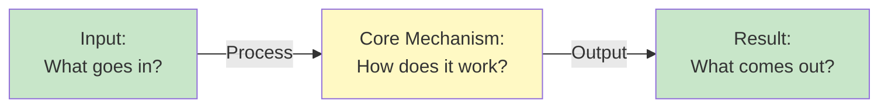

# Core Concepts — Deep Dive

> **Level:** 🟢 Beginner  
> **Pre-reading:** None (this is the starting point)  
> **Time:** 30–40 minutes

---

## What Are Core Concepts?

Start with a **clear, plain-language explanation**. Don't use jargon yet.

This is your topic at its simplest. Think about how you'd explain it to someone who's never heard of it before.

---

## Why This Matters

Explain the **practical value** in 2–3 sentences:

- Point 1: Why businesses/users care
- Point 2: Real-world impact  
- Point 3: How it solves a problem

---

## How It Works — The Big Picture



**Explain each step:**

- **Input:** What's the starting point?
- **Process:** What happens in the middle?
- **Output:** What's the end result?

---

## Key Principles

| Principle | Explanation | Example |
|---|---|---|
| **Principle 1** | What is it? How is it useful? | Real example or scenario |
| **Principle 2** | What is it? How is it useful? | Real example or scenario |
| **Principle 3** | What is it? How is it useful? | Real example or scenario |

---

## Comparison: Core Concepts vs Related Ideas

| Aspect | Core Concept | Related Idea | Best For |
|---|---|---|---|
| **Use case** | When to use A | When to use B | [Scenario] |
| **Complexity** | Simple to understand | More complex | [When] |
| **Performance** | Fast/slow | Fast/slow | [When] |
| **Learning curve** | Easy/hard | Easy/hard | [Who] |

---

## A Real-World Example

```
Scenario: [Describe a real situation]

What happens:
1. [Step 1]
2. [Step 2]
3. [Step 3]

Result: [What this demonstrates]
```

---

## The Math (If Applicable)

> 💡 *Skip this if you just want the intuition — come back when you're ready.*

**Concept:** What's the mathematical foundation?

$$
\text{formula} = \frac{\text{numerator}}{\text{denominator}}
$$

**What each term means:**

| Symbol | Meaning | Example |
|---|---|---|
| $A$ | [Definition] | [Concrete example] |
| $B$ | [Definition] | [Concrete example] |

**Worked example:**

$$
\text{result} = \frac{10}{2} = 5
$$

---

## Common Misconceptions

??? question "Myth: [Common wrong belief]?"
    **Reality:** [Correct understanding]  
    Why people get this wrong: [Explanation]

??? question "Myth: [Another common mistake]?"
    **Reality:** [Correct understanding]  
    The key insight: [Explanation]

---

## Interview Questions

These are typical interview questions on this topic. Try answering before reading the model answer.

??? question "Interview Q: What is [core concept] in simple terms?"
    **Model answer:** [2-3 sentence clear explanation]  
    **Why this matters:** [Why interviews ask this]

??? question "Interview Q: How does [concept] differ from [related concept]?"
    **Model answer:** [Clear comparison highlighting key differences]  
    **Why this matters:** [Context]

??? question "Interview Q: When would you use [this concept]?"
    **Model answer:** [Practical scenarios with examples]  
    **Why this matters:** [Context]

---

## Key Takeaways

| Concept | Takeaway |
|---|---|
| **[Concept 1]** | One-line summary of the key insight |
| **[Concept 2]** | One-line summary of the key insight |
| **[Concept 3]** | One-line summary of the key insight |

---

## What's Next?

→ **Next article:** [Key Principles](02-key-principles.md)

You now understand the fundamentals. Ready to go deeper? Move on to key principles, or jump to [Quick Reference](../reference/01-quick-reference.md) if you need definitions.

---

## Resources

- [Quick Reference](../reference/01-quick-reference.md) — Definitions and cheatsheet
- [FAQ](../00-introduction/02-faq.md) — Common questions
- [Interview Q&A](../reference/03-interview-qa.md) — More interview prep

---

--8<-- "_abbreviations.md"
