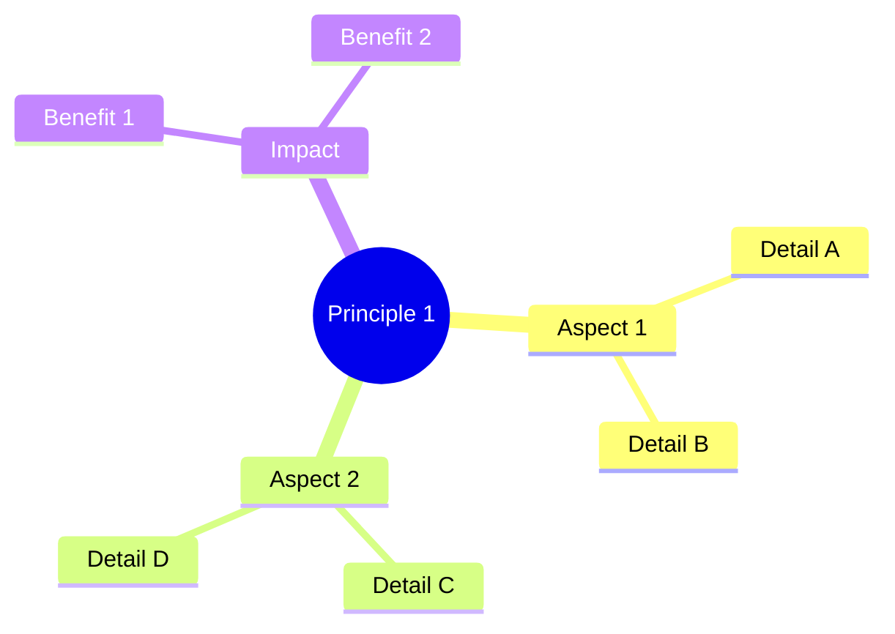

# Key Principles

> **Level:** 🟢 Beginner  
> **Pre-reading:** [Core Concepts](01-core-concepts.md)  
> **Time:** 30–40 minutes

---

## Introduction

Build on the core concepts from the previous article. Explain how principles guide practical work.

---

## Principle 1: [Name]

### What Is It?

Clear explanation of the principle.

### Why It Matters

Practical implications and real-world examples.

---

## Principle 2: [Name]

### What Is It?

Clear explanation.

### Why It Matters

Real-world examples and implications.

---

## Principle 3: [Name]

### What Is It?

Clear explanation.

### Why It Matters

Real-world examples and implications.

---

## Interview Questions

??? question "Q: How do these principles apply to [scenario]?"
    **Answer:** [Model answer]

??? question "Q: Which principle is most important and why?"
    **Answer:** [Model answer]

---

## Summary

| Principle | Key Insight | Application |
|---|---|---|
| [Name] | One-liner | Where to apply |
| [Name] | One-liner | Where to apply |
| [Name] | One-liner | Where to apply |

---

→ **Next:** [Intermediate: Building Blocks](../02-intermediate/01-building-blocks.md)

--8<-- "_abbreviations.md"
