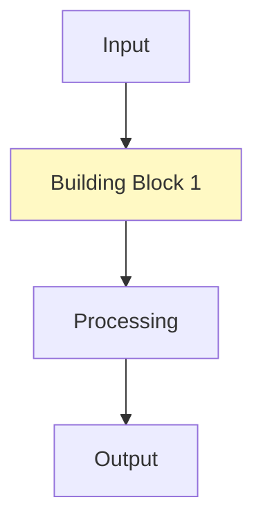
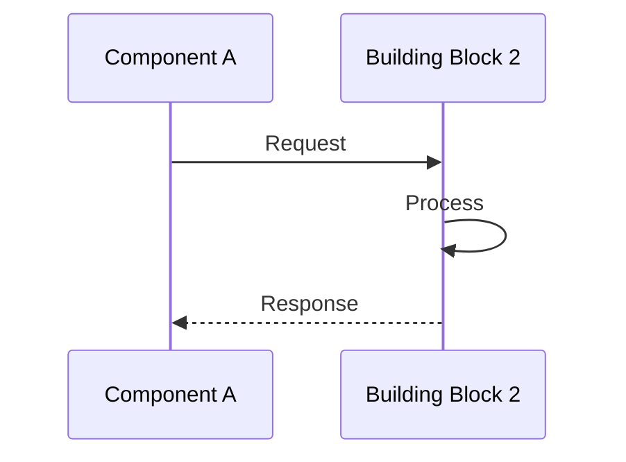
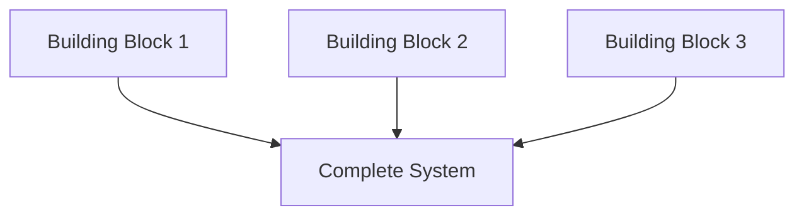

# Building Blocks

> **Level:** 🟡 Intermediate  
> **Pre-reading:** [Core Concepts](../01-fundamentals/01-core-concepts.md) · [Key Principles](../01-fundamentals/02-key-principles.md)  
> **Time:** 40–50 minutes

---

## How Concepts Fit Together

Explain how the pieces from fundamentals combine into larger patterns.

---

## Building Block 1: [Component]

### Purpose

What role does this play?

### How It Works

### When to Use It

Real scenarios and decision points.

---

## Building Block 2: [Component]

### Purpose

What role does this play?

### How It Works

### When to Use It

Real scenarios and decision points.

---

## Putting It All Together

---

## Practical Example

[Code example or real scenario]

---

## Interview Questions

??? question "Q: How would you combine these blocks for [scenario]?"
    **Answer:** [Model answer]

---

→ **Next:** [Practical Applications](02-practical-applications.md)

--8<-- "_abbreviations.md"
