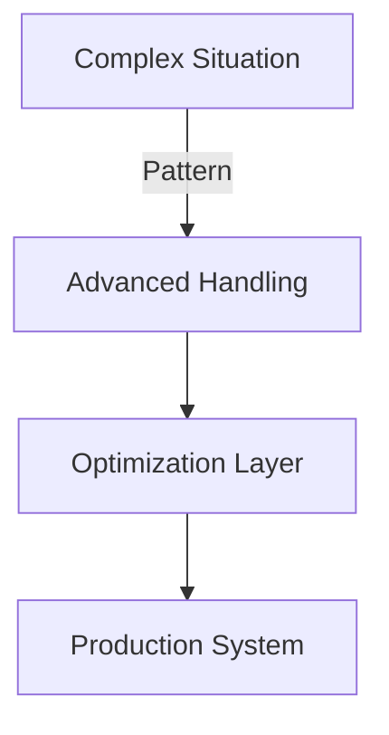

# Advanced Patterns

> **Level:** 🔴 Advanced  
> **Pre-reading:** [Building Blocks](../02-intermediate/01-building-blocks.md) · [Practical Applications](../02-intermediate/02-practical-applications.md)  
> **Time:** 50–60 minutes

---

## Expert-Level Strategies

These patterns emerge from experience at scale. Use them for complex, nuanced scenarios.

---

## Pattern 1: [Advanced Approach]

### When to Use It

What conditions make this pattern valuable?

### How It Works

### Implementation

Code example or technical breakdown.

### Trade-offs

- Benefit 1: What you gain
- Cost 1: What you sacrifice
- When worth it: The scenarios where this pays off

---

## Pattern 2: [Advanced Approach]

### When to Use It

What conditions make this pattern valuable?

### How It Works

Explanation of the advanced mechanism.

### Implementation

Code or process example.

### Real-World Considerations

What works in theory vs. practice.

---

## Interview Questions

??? question "Q: When would you choose [Pattern 1] over [Pattern 2]?"
    **Answer:** [Detailed comparison with decision factors]

??? question "Q: How do these patterns scale to [large scenario]?"
    **Answer:** [Analysis of scalability and limitations]

---

→ **Next:** [Production Considerations](02-production-considerations.md)

--8<-- "_abbreviations.md"
