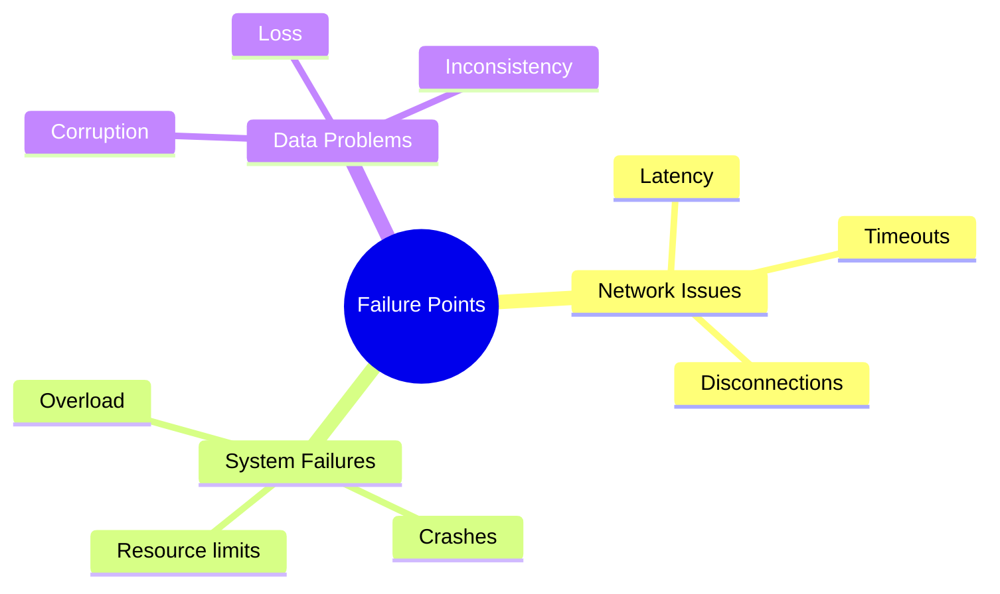

# Production Considerations

> **Level:** 🔴 Advanced  
> **Pre-reading:** [Advanced Patterns](01-advanced-patterns.md)  
> **Time:** 50–60 minutes

---

## Building for the Real World

Production systems have constraints, failures, and complexities that theory doesn't always capture.

---

## Reliability & Resilience

### What Can Go Wrong?

### How to Handle It

Strategies for each failure mode.

### Real Examples

Lessons from production incidents.

---

## Performance @ Scale

### Bottlenecks

Where do systems typically slow down?

### Optimization Strategies

| Strategy | Improvement | Cost | Trade-offs |
|---|---|---|---|
| [Optimization A] | [Improvement] | [Cost] | [Trade-off] |

### Monitoring & Observability

What metrics matter? How to detect problems?

---

## Security

### Threat Vectors

What are the main attack vectors in this context?

### Defense Strategies

How to protect against each threat.

---

## Operations & Maintenance

### Deployment

How to safely get code to production.

### Monitoring

What to watch for in production.

### Debugging

How to troubleshoot when things go wrong.

---

## Interview Questions

??? question "Q: How would you make [system] reliable at scale?"
    **Answer:** [Strategies for reliability]

??? question "Q: What are the main failure modes and how do you mitigate them?"
    **Answer:** [Analysis of risks and solutions]

---

→ **Next:** [Reference: Quick Cheatsheet](../reference/01-quick-reference.md)

--8<-- "_abbreviations.md"
