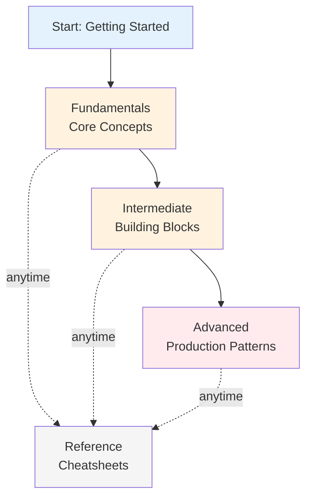

# Welcome to Your Learning Guide

> A progressive, self-paced learning journey — from first principles to expert-level mastery.

---

## 🎯 What You'll Learn

This guide takes you from **zero to expert** on your chosen topic. Each section builds on the last, with clear explanations, interactive diagrams, math where it matters, and interview-ready Q&A.

| Section | Focus | Level |
|---|---|---|
| **Getting Started** | Prerequisites & learning path | 🚀 Setup |
| **Fundamentals** | Core concepts and vocabulary | 🟢 Beginner |
| **Intermediate** | How concepts work together | 🟡 Intermediate |
| **Advanced** | Production patterns & edge cases | 🔴 Advanced |
| **Reference** | Quick-lookup cheatsheets | 📋 All levels |

---

## 🗺️ Learning Path

---

## 🚀 Getting Started Now

1. **Not sure where to start?** → [Prerequisites & Navigation Guide](GETTING_STARTED.md)
2. **Ready to dive in?** → [Learning Path Overview](00-introduction/01-learning-path.md)
3. **Have questions?** → [FAQ](00-introduction/02-faq.md)
4. **Looking for quick answers?** → [Quick Reference](reference/01-quick-reference.md)

---

## ✨ How This Guide Works

### Hover Over Underlined Terms
Learn definitions without leaving the page:
*[API]: Application Programming Interface — a set of rules for how software components communicate.

### Interactive Diagrams
See concepts visualized with Mermaid diagrams. *Click to expand or zoom.*

### Math Where It Matters
Complex topics include equations with explanations:

$$
\text{clarity} = \frac{\text{explanation}}{\text{jargon}} + \text{diagrams}
$$

### Interview Practice
Every section includes **"Interview Questions"** blocks with model answers — prepare for technical conversations while learning.

---

## 📚 Progressive Difficulty

- **🟢 Beginner**: Start here, no prior knowledge assumed
- **🟡 Intermediate**: You understand fundamentals, ready for deeper concepts
- **🔴 Advanced**: Expert-level patterns, production considerations, edge cases

Each article clearly marks its difficulty level.

---

## 💡 Key Features

✅ **Tab-based navigation** — jump between sections easily  
✅ **Dark/light theme** — click the toggle (top right) for your preference  
✅ **Full-text search** — use the search box to find topics  
✅ **Mobile-friendly** — read on any device  
✅ **Copy code blocks** — click the copy icon in code samples  
✅ **Permanent links** — share specific sections with others  

---

## 🎓 About This Guide

This is a **learning-first resource**:
- Written for practitioners, not academics
- Real-world examples over theory
- Progressive complexity (basics → advanced)
- Links between related topics
- Hands-on when applicable

---

## 📖 Next Steps

→ **[Go to Getting Started](GETTING_STARTED.md)** for prerequisites and a roadmap.

Or pick a section:
- **[Fundamentals → Core Concepts](01-fundamentals/01-core-concepts.md)**
- **[Intermediate → Building Blocks](02-intermediate/01-building-blocks.md)**
- **[Advanced → Advanced Patterns](03-advanced/01-advanced-patterns.md)**

---

### *Built with best practices from 15+ real learning projects*

**Tips:**
- Bookmark [Quick Reference](reference/01-quick-reference.md) for later
- Use your browser's reader mode for distraction-free reading
- Questions? See [FAQ](00-introduction/02-faq.md)

--8<-- "_abbreviations.md"
