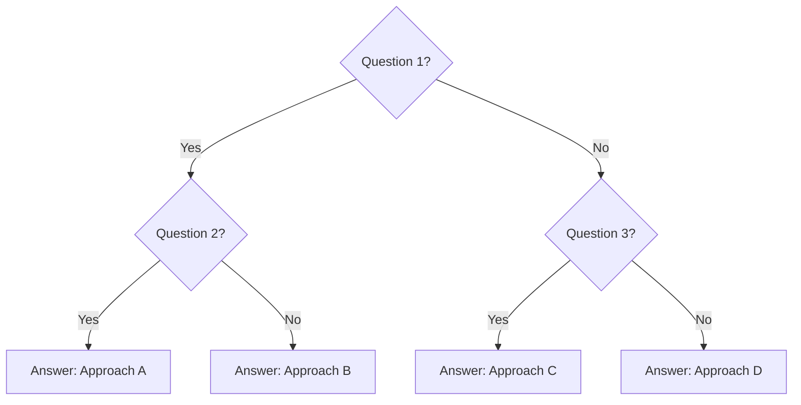

# Quick Reference

> Jump here when you need fast answers. No prerequisites — use anytime.

---

## Definitions & Terminology

See [_abbreviations.md](../_abbreviations.md) for the complete glossary. Here are the most important terms:

| Term | Definition |
|---|---|
| **[Key Term 1]** | [Quick definition] |
| **[Key Term 2]** | [Quick definition] |
| **[Key Term 3]** | [Quick definition] |

---

## Key Concepts at a Glance

### Core Idea

[One paragraph summarizing the entire topic]

### The Three-Tier Model

- **Fundamentals:** [One sentence]
- **Intermediate:** [One sentence]
- **Advanced:** [One sentence]

---

## Common Patterns

| Pattern | Use Case | Example |
|---|---|---|
| [Pattern A] | When to use | [Simple example] |
| [Pattern B] | When to use | [Simple example] |

---

## Comparison Matrix

Quick lookup for comparing related concepts:

| Aspect | Option A | Option B | Best For |
|---|---|---|---|
| **Complexity** | | | |
| **Performance** | | | |
| **Scalability** | | | |
| **Cost** | | | |
| **Learning curve** | | | |

---

## Decision Tree

When in doubt, use this to choose the right approach:



---

## Cheatsheet

### Quick Syntax / Examples

```python
# Example code
# ...
```

### Command Reference

```bash
# Common commands
# ...
```

---

## When to Read Each Section

| You need... | Go to... | Time |
|---|---|---|
| **Basic understanding** | [Core Concepts](../01-fundamentals/01-core-concepts.md) | 30 min |
| **How things fit together** | [Building Blocks](../02-intermediate/01-building-blocks.md) | 40 min |
| **Real-world application** | [Practical Applications](../02-intermediate/02-practical-applications.md) | 40 min |
| **Expert strategies** | [Advanced Patterns](../03-advanced/01-advanced-patterns.md) | 50 min |
| **Production guidelines** | [Production Considerations](../03-advanced/02-production-considerations.md) | 50 min |
| **Interview prep** | [Interview Q&A](03-interview-qa.md) | 20 min |

---

## Links to All Sections

**Fundamentals (🟢 Beginner)**  
→ [Core Concepts](../01-fundamentals/01-core-concepts.md)  
→ [Key Principles](../01-fundamentals/02-key-principles.md)  

**Intermediate (🟡 Building Blocks)**  
→ [Building Blocks](../02-intermediate/01-building-blocks.md)  
→ [Practical Applications](../02-intermediate/02-practical-applications.md)  

**Advanced (🔴 Expert)**  
→ [Advanced Patterns](../03-advanced/01-advanced-patterns.md)  
→ [Production Considerations](../03-advanced/02-production-considerations.md)  

**Getting Help**  
→ [FAQ](../00-introduction/02-faq.md)  
→ [Learning Path](../00-introduction/01-learning-path.md)  

---

--8<-- "_abbreviations.md"
